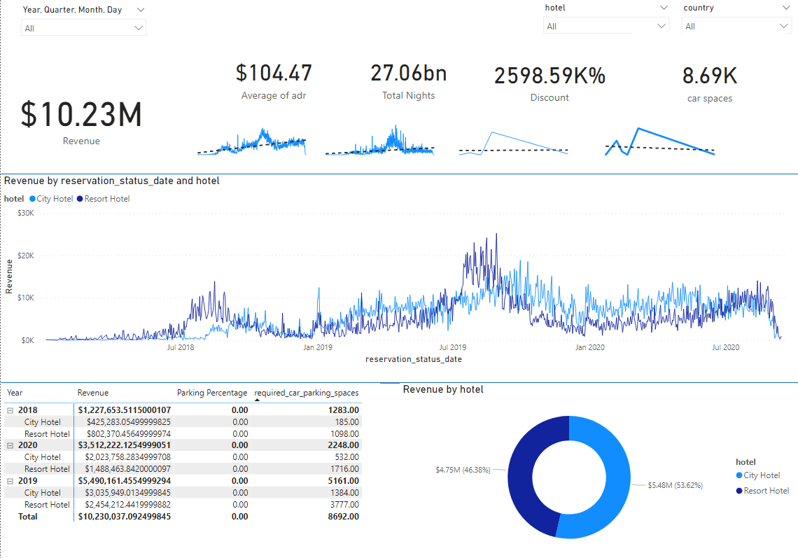

# Hotel Data/Buisness Analysis 
---
## Requirements 

- Build a visual data story or dashboard using Power BI to present to stakeholders

- "Is our hote revenue growing by the year?"

- We have two hotel types, segment revenue by hotel type

- "Should we increase our parking lot size?"

- We want to understand if there is a trend with guests w/ personal cars

- "What trends can we see in the data?"

- Focus on average daily rate and guests to explore seasonality.

## Project Pipeline
1. Build a Database 
2. Develop the SQL Query 
3. Connect Power BI to the Database 
4. Visualize Data
5. Summerize Findings

## SQL Query

```
with hotels as (
select * from dbo.[2018]
union
select * from dbo.[2019]
union
select * from dbo.[2020])

select * from hotels
left join dbo.market_segment
on hotels.market_segment = market_segment.market_segment
left join dbo.meal_cost
on meal_cost.meal = hotels.meal
```

## Screen Shot 
